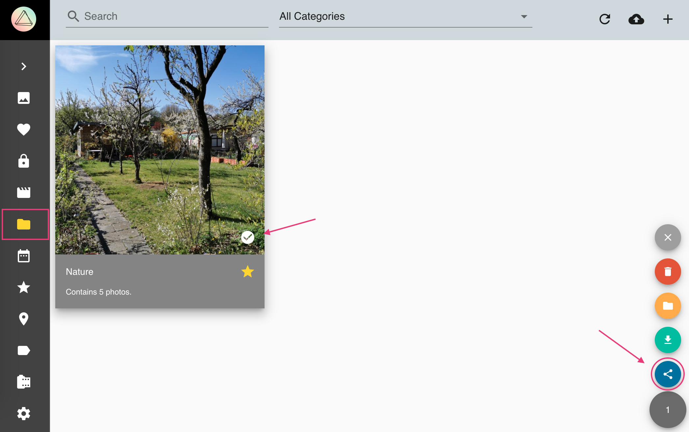
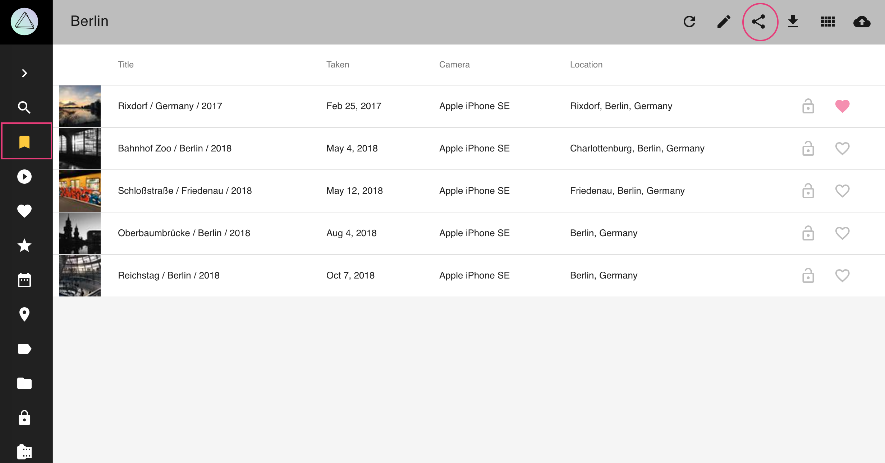
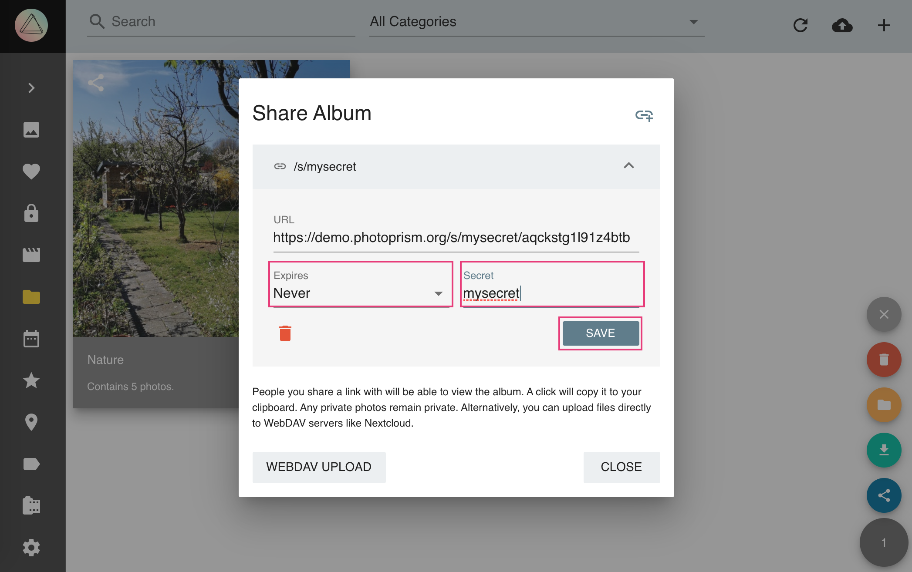
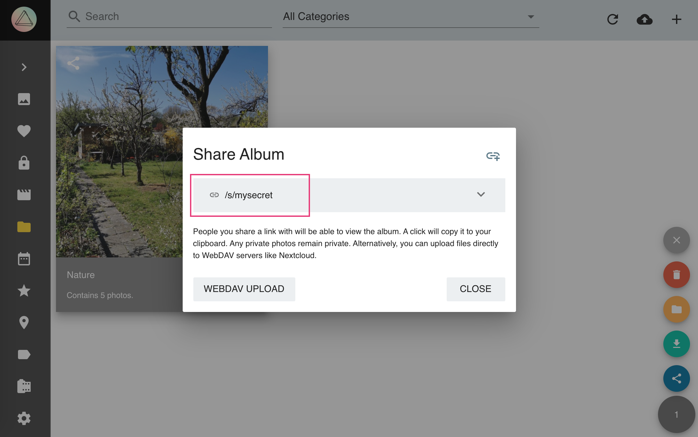
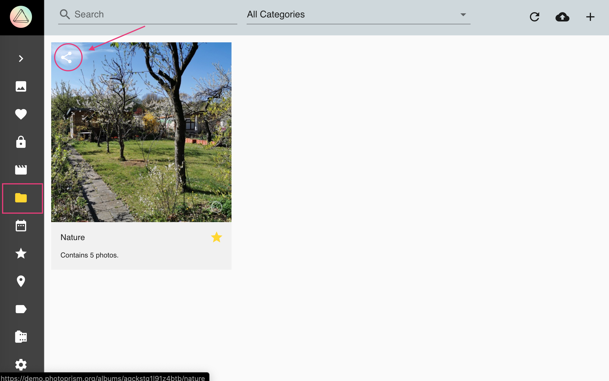
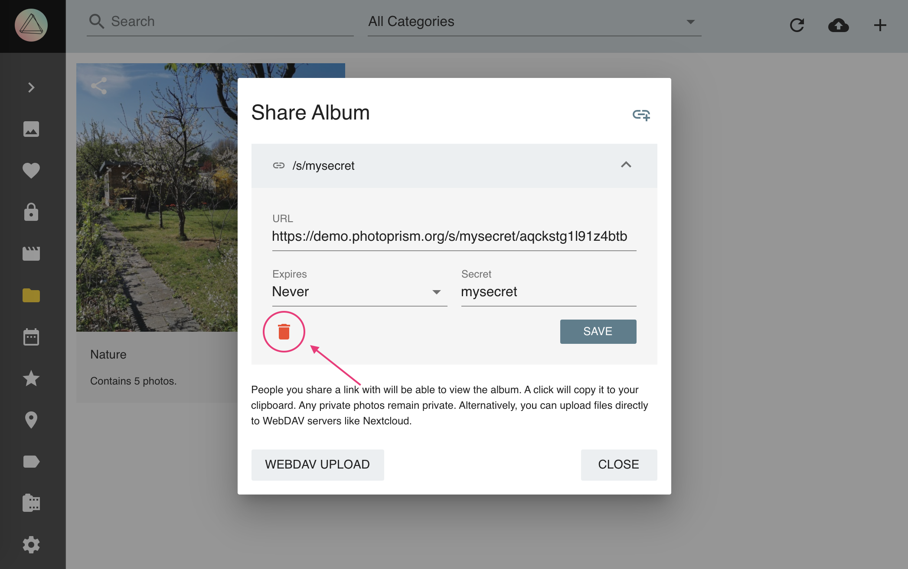

# Sharing Albums via Link #

## Create Sharing Link ##
1. Go to *Albums*
2. Select the album you want to share
3. Open the context menu
4. Click :material-share-variant:
    
    
    
Or

2. Open the album by clicking on it
3. Click :material-share-variant:

   

Then

5. Click :material-chevron-down: to open the *link details*
6. Set a *secret* and *expiry date*
7. Click *save*
    
    
    
8. Copy the link by clicking on it
    
    
    
9. Share it with your friends

!!!tip
    You can create additional links with different secrets and expiry dates by clicking :material-link-plus:.

## Delete Sharing Link ##

1. Go to *Albums*
2. Click :material-share-variant: on the album cover

    
    
3. Click :material-chevron-down:
4. Click :material-delete:

     