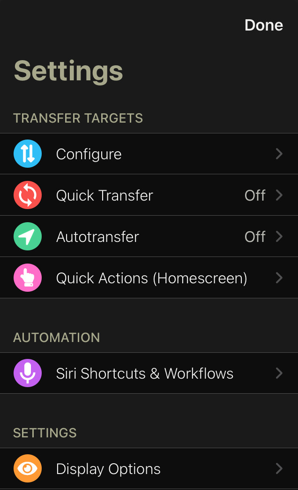
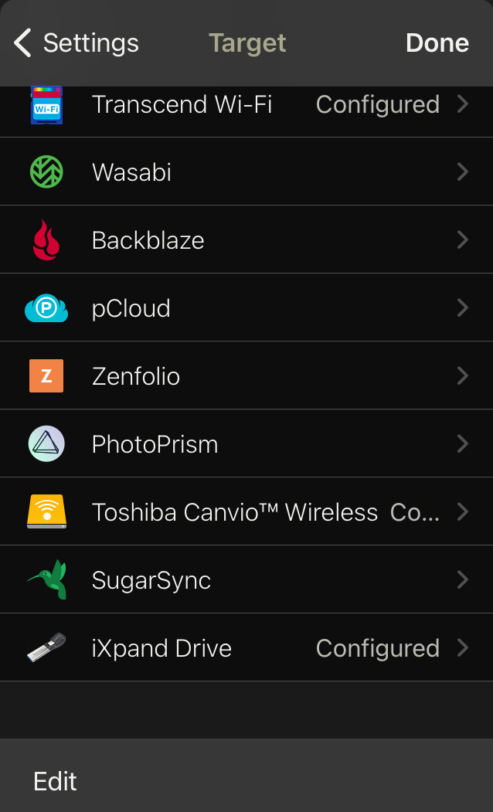
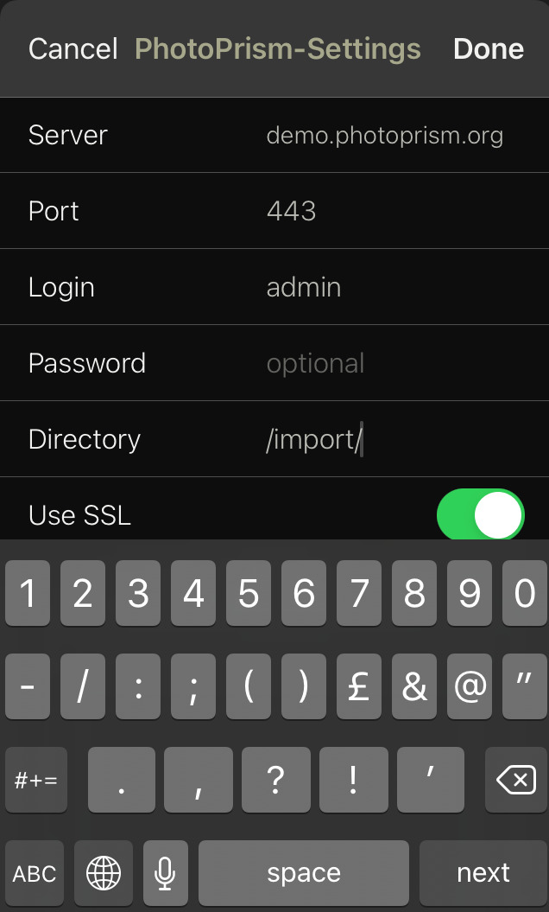
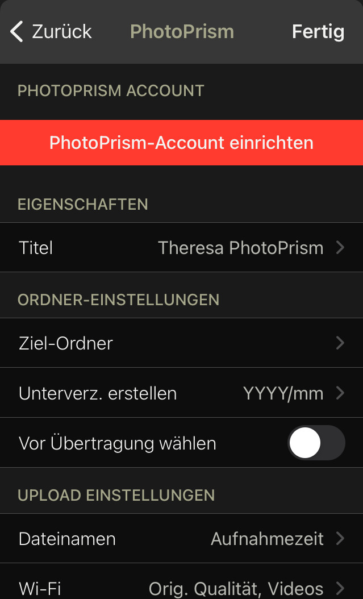
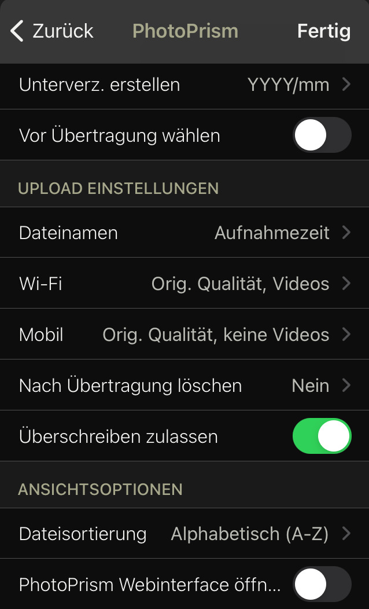
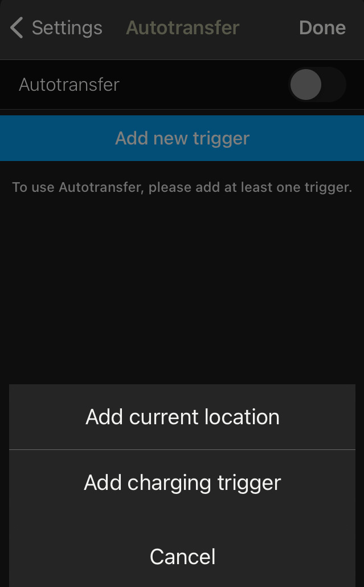
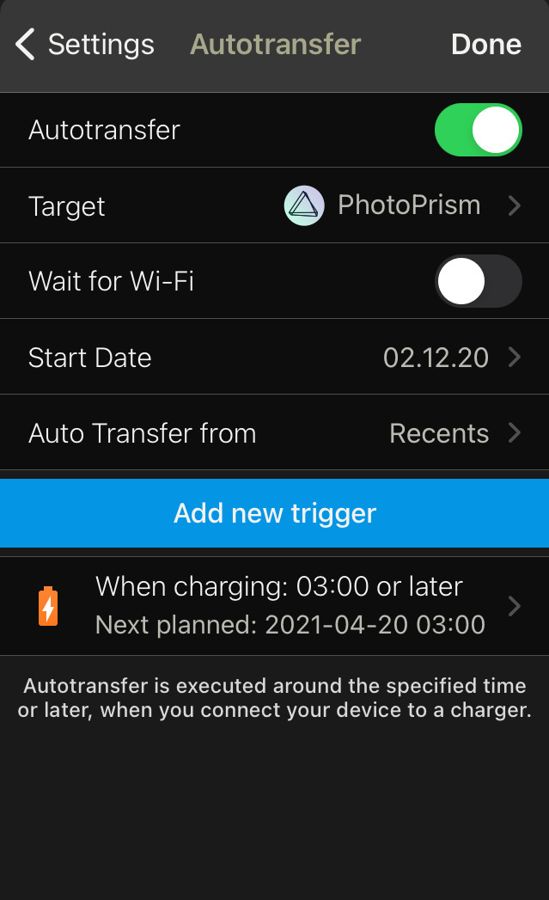

# Syncing with Mobile Devices

You can use any app that supports the [WebDAV protocol](webdav.md) to synchronize photos and videos between your phone and PhotoPrism.

Based on our own experience, we can highly recommend [PhotoSync](https://link.photoprism.app/photosync) as it is one of the most feature-rich and sophisticated apps currently available for iOS and Android.

An overview of [mobile sync apps](#sync-apps-for-ios-and-android) for iOS and Android can be found below.

!!! tldr ""
    WebDAV access can be disabled under [Settings > Advanced](../settings/advanced.md). Since it requires write permissions and authentication, the built-in WebDAV server is automatically disabled when running in [read-only](../../getting-started/config-options.md#feature-flags) or [public mode](../../getting-started/config-options.md#authentication).

## Using PhotoSync

### Set PhotoPrism or WebDAV as Target

1. Open PhotoSync and click :material-cog-outline:
2. Click *Configure*
3. Select PhotoPrism as target

    {: style="width:35%" class="shadow"}
    {: style="width:35%" class="shadow"}

4. Enter your settings

    !!! info ""
        *Server:* Your server url, e.g. "example.com".
        
        *Port:* Your port. If you are using HTTPS the port is 443.

        *Login:* Your username, e.g. "admin".
        
        *Password:* Your admin password.

        *Directory:* /import/ or /originals/ depending on your preferred [ingestion method](../library/index.md).
        
        *Use SSL:* Should be enabled.

        [PikaPods](../../getting-started/cloud/pikapods.md) users can find more information [here](https://docs.pikapods.com/apps/photoprism/#sync-from-mobile-apps). 

      {: style="width:35%" class="shadow"}

6. Click *Done*
7. You may adapt transfer details to match your preferences

      {: style="width:35%" class="shadow"}
      {: style="width:35%" class="shadow"}

### Set Up Automatic Sync

1. Open PhotoSync and click :material-cog-outline:
2. Click *Autotransfer*

      {: style="width:35%" class="shadow"}

3. Click *Add new trigger* and choose one or more trigger

      {: style="width:35%" class="shadow"}

4. Choose PhotoPrism as target
5. Click *Done*

      {: style="width:35%" class="shadow"}

Because PhotoSync uses WebDAV to send files, PhotoPrism automatically starts importing/indexing when it receives new files.

## Sync Apps for iOS and Android

As an alternative to [PhotoSync](#using-photosync), you can also use a wide range of other apps to synchronize your pictures with PhotoPrism, either [directly via WebDAV](webdav.md#server-url) or by sharing the [
*originals* folder](../backups/folders.md#originals) as an [SMB network drive](https://ubuntu.com/server/docs/samba-as-a-file-server){:target="_blank"} through your [operating system](https://support.microsoft.com/en-us/windows/file-sharing-over-a-network-in-windows-b58704b2-f53a-4b82-7bc1-80f9994725bf){:target="_blank"} or [cloud provider](https://learn.microsoft.com/en-us/azure/storage/files/files-smb-protocol){:target="_blank"}:

| Name                                                                                                                            | Platform     | Synchronization                     | Price  | Download                                                                                                                                                                                                                |
|---------------------------------------------------------------------------------------------------------------------------------|--------------|-------------------------------------|--------|-------------------------------------------------------------------------------------------------------------------------------------------------------------------------------------------------------------------------|
| [PhotoSync Pro](https://www.photosync-app.com/support/ios/answers/what-is-the-difference-between-photosync-pro-and-premium)     | iOS, Android | [WebDAV](#using-photosync), SMB     | €6.99  | [App Store](https://link.photoprism.app/photosync-ios), [Google Play](https://link.photoprism.app/photosync-android)                                                                                                    |
| [PhotoSync Premium](https://www.photosync-app.com/support/ios/answers/what-is-the-difference-between-photosync-pro-and-premium) | iOS, Android | [WebDAV](#using-photosync), SMB     | €24.99 | [App Store](https://link.photoprism.app/photosync-ios), [Google Play](https://link.photoprism.app/photosync-android)                                                                                                    |
| [EasySync](https://github.com/phpbg/easysync)                                                                                   | Android      | [WebDAV](webdav.md#server-url)      | €2.99  | [Google Play](https://play.google.com/store/apps/details?id=com.phpbg.easysync&pcampaignid=pcampaignidMKT-Other-global-all-co-prtnr-py-PartBadge-Mar2515-1), [F-Droid](https://f-droid.org/packages/com.phpbg.easysync) |
| [Syncthing](https://syncthing.net/)                                                                                             | Android      | Syncthing                           | Free   | [Google Play](https://play.google.com/store/apps/details?id=com.nutomic.syncthingandroid)                                                                                                                               |
| [FolderSync Pro](https://foldersync.io/)                                                                                        | Android      | [WebDAV](webdav.md#server-url), SMB | €6.49  | [Google Play](https://play.google.com/store/apps/details?id=dk.tacit.android.foldersync.full)                                                                                                                           |
| [Owlfiles Pro](https://www.skyjos.com/owlfiles/)                                                                                | iOS, Android | [WebDAV](webdav.md#server-url), SMB | €59.99 | [App Store](https://itunes.apple.com/app/id510282524), [Google Play](https://play.google.com/store/apps/details?id=com.skyjos.apps.fileexplorerfree)                                                                    |

!!! note ""
    Note that this overview is provided for your convenience only and that we are unable to provide [technical support](https://www.photoprism.app/kb/getting-support) for any of these apps. If you have problems, please contact the author or ask the community for help. You are [welcome to suggest](https://github.com/photoprism/photoprism-docs/tree/master/docs/user-guide/sync/mobile-devices.md) additional sync apps, so we can include them in this list.
