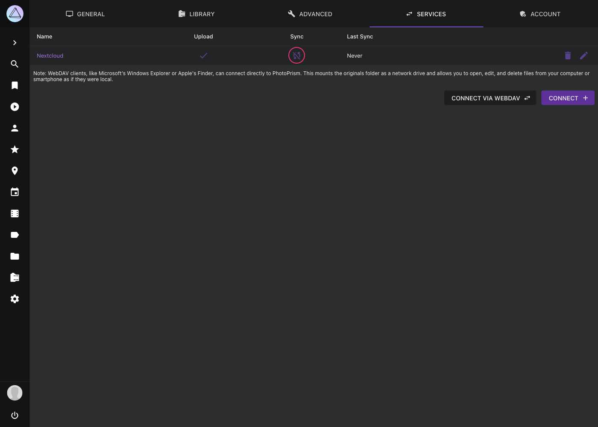
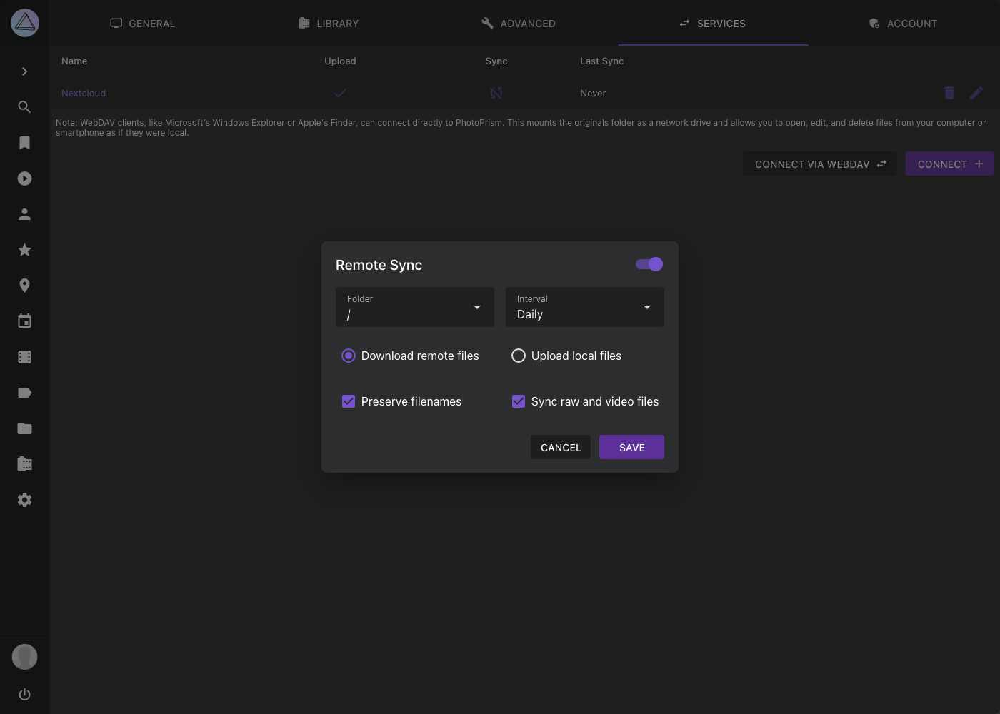

# Syncing with other WebDAV-compatible Apps and Services

Under [Settings > Services](../settings/sync.md) you can connect your PhotoPrism instance to other apps and services that can be accessed via WebDAV, e.g. other PhotoPrism instances, Nextcloud or ownCloud.

!!! danger ""
    When syncing, your files will be uploaded or downloaded to/from another service, which requires additional storage space. If you want PhotoPrism to index files from another local application, e.g. Nextcloud, we recommend mounting its file storage directory as [*originals* folder](../../getting-started/docker-compose.md#photoprismoriginals) instead of synchronizing the files via WebDAV. This prevents unnecessary copies of your files from being created.

## Automatically Upload/Download Files to/from another App

1. Go to *Settings*
2. Open *Services* tab
3. Click into the sync cell of your service
   { class="shadow" }
4. Enable synchronization in the upper right corner
5. Choose a folder from your service
6. Choose a sync interval
7. Select the options that are suitable for you and click *Save*

{ class="shadow" }

### Remote Sync Options

- *Download remote files* will download all files from the selected folder of the other service that do not yet exist in PhotoPrism
- *Upload local files* will upload all files (including private or archived ones) from PhotoPrism to your service that do not yet exist there
- *Preserve filenames* will keep filenames without renaming them
- *Sync raw and video files* will upload/download raw and video files alongside with JPEGs.

### Troubleshooting Slow or Depth-Limited Servers

PhotoPrism prefers `PROPFIND Depth: infinity` for recursive directory discovery and automatically falls back to iterative `Depth: 1` traversal for WebDAV servers that reject the recursive form (for example pCloud and similar providers). When the fallback is used, the application log records the number of follow-up requests and the elapsed traversal time, so you can grep the logs for `depth-1 fallback` or `PROPFIND` to confirm what the client did during a slow sync. Hidden dotfiles and entries inside hidden dot-directories are excluded from listings because they often represent lock files, partial uploads, or provider metadata.

Large file transfers are not subject to a total request deadline, but PhotoPrism applies separate connect, TLS-handshake, idle-connection, and expect-continue timeouts to recover quickly from stalled or unresponsive servers without interrupting an in-flight transfer.
