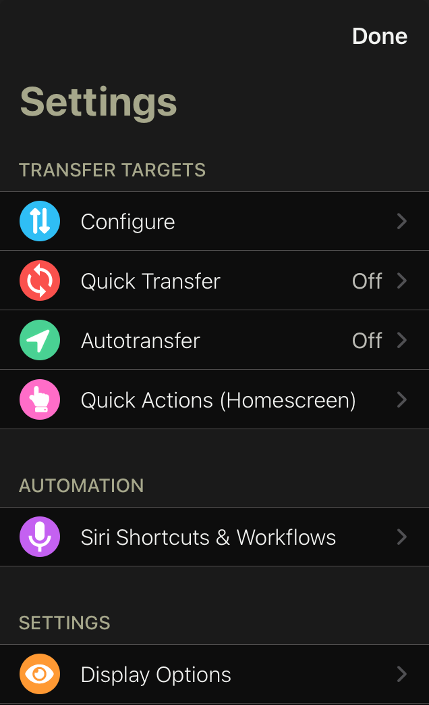
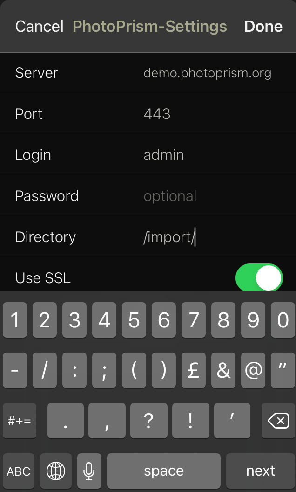
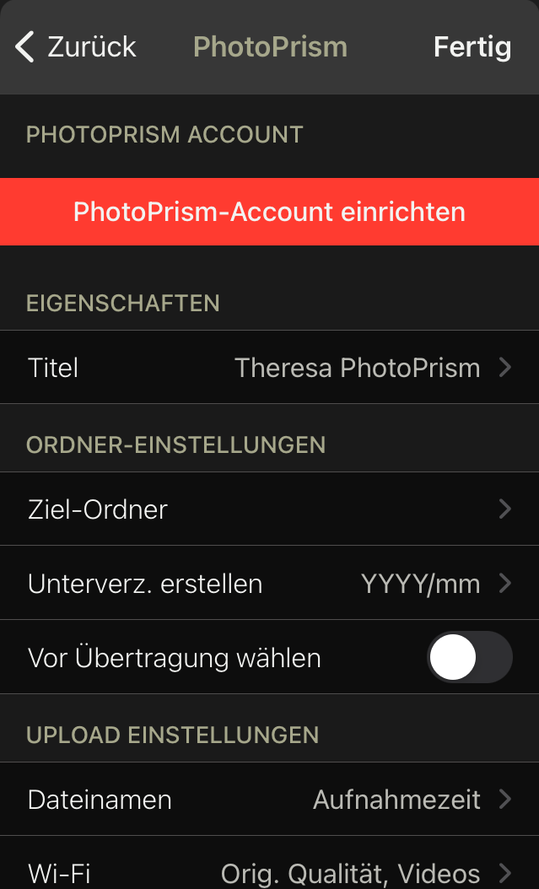
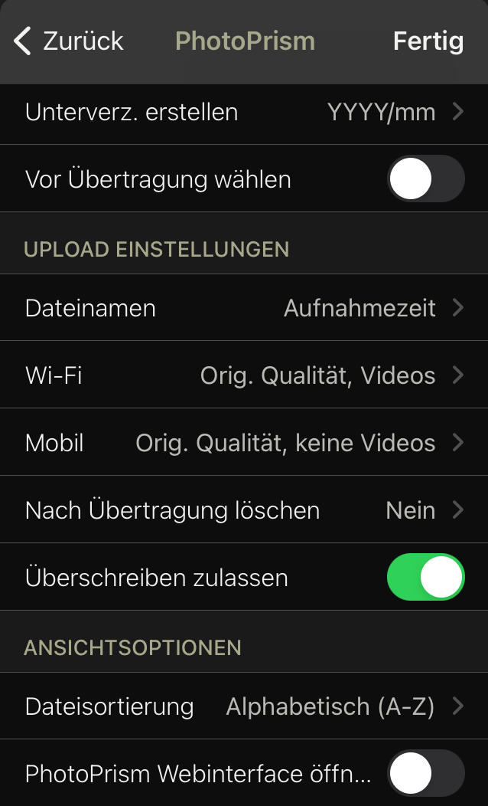
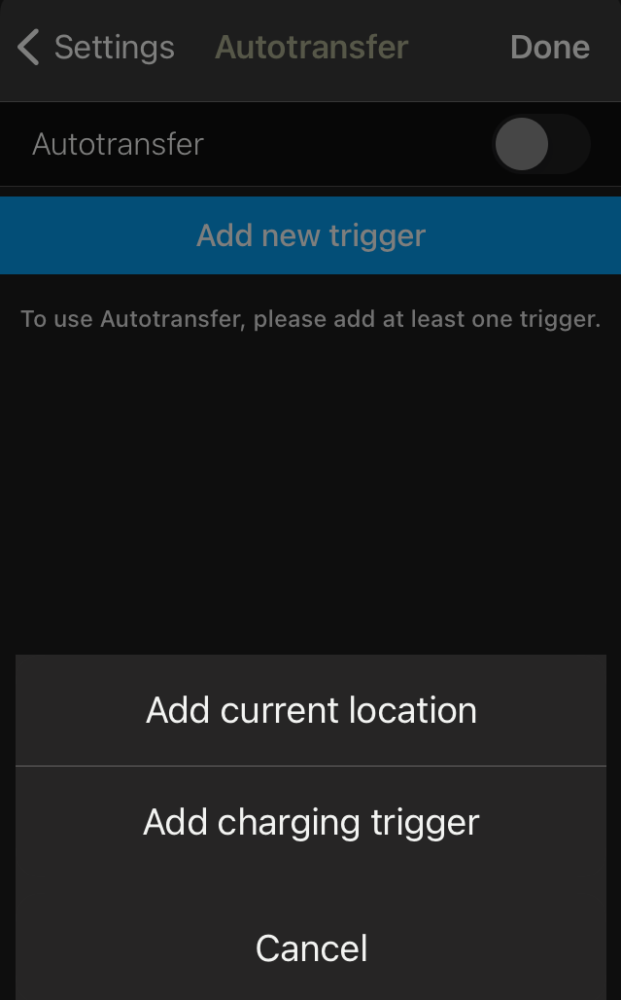
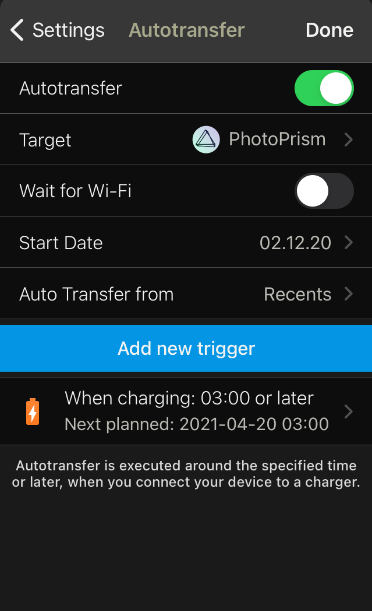

# Synchronize Photos from Mobile Devices #
To synchronize photos/videos from your phone to PhotoPrism, you can use any app that supports file sync via WebDAV.

!!! info
      In public mode WebDAV is disabled per default.

## PhotoSync ##
We recommend [PhotoSync](https://www.photosync-app.com/home.html) which is available for Android and iOS.

### Set PhotoPrism as Target ###
1. Open PhotoSync and click :material-cog-outline:
2. Click *Configure*
3. Select PhotoPrism as target

      {: style="width:35%"}
      {: style="width:35%"}

4. Enter your settings

      {: style="width:35%"}

5. Click *Done*
6. You may adapt transfer details to match your preferences
   
      {: style="width:35%"}
      {: style="width:35%"}

!!! attention
      If you are using PhotoSync on Android you need to choose WebDAV as target.

### Set Up Automatic Sync ###
1. Open PhotoSync and click :material-cog-outline:
2. Click *Autotransfer*

      {: style="width:35%"}

3. Click *Add new trigger* and choose one or more trigger
   
      {: style="width:35%"}
   
4. Choose PhotoPrism as target
5. Click *Done*

      {: style="width:35%"}

As PhotoSync uses WebDAV to send files, PhotoPrism will automatically start importing/indexing each time it receives new files.

## Other apps ##
As long as you run PhotoPrism on a device where it is possible to enable Samba (Windows File Sharing), you can use this free opensource Android app:
[SMBSync2 - Github](https://github.com/Sentaroh/SMBSync2/releases) | [SMBSync2 - Google Play](https://play.google.com/store/apps/details?id=com.sentaroh.android.SMBSync2)
