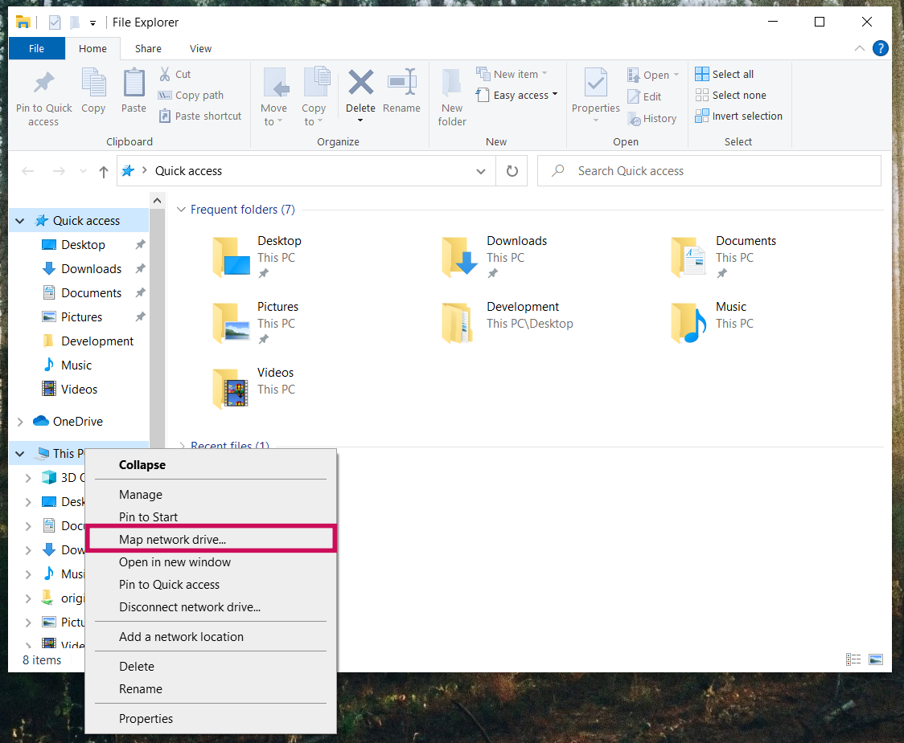
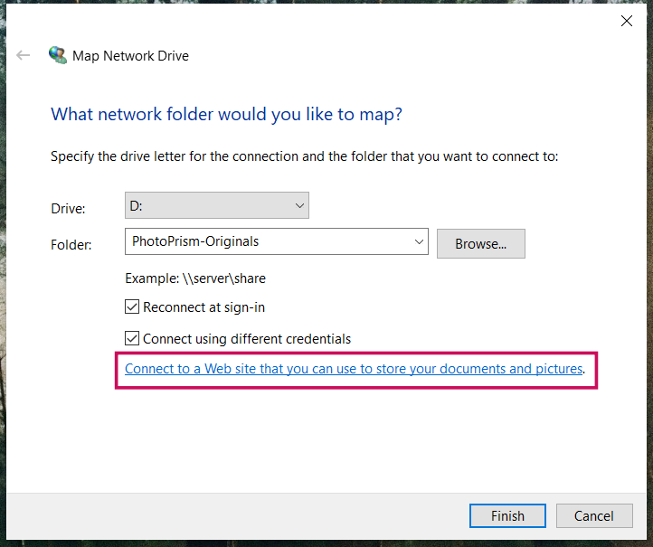
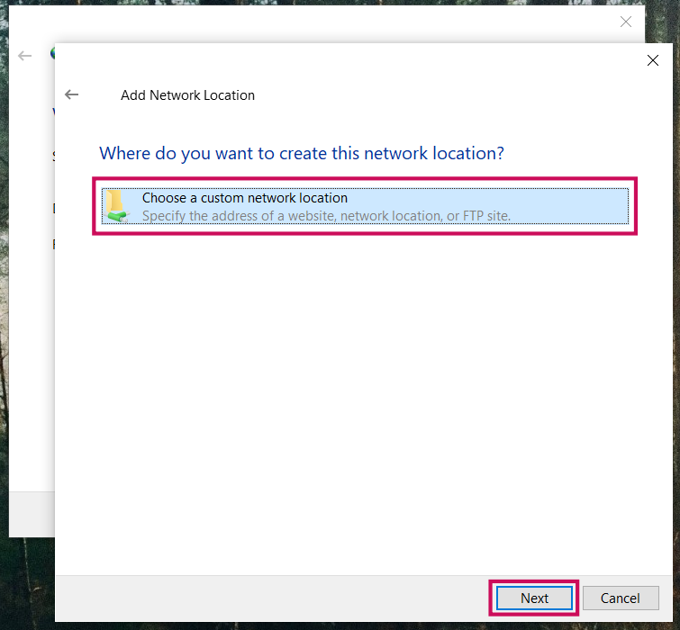
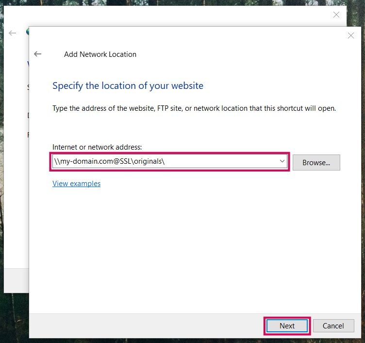
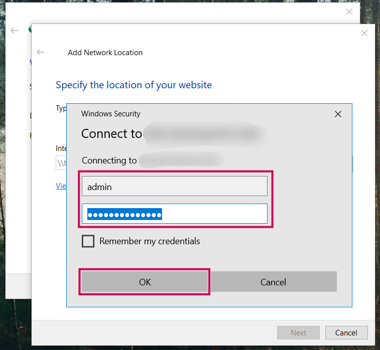
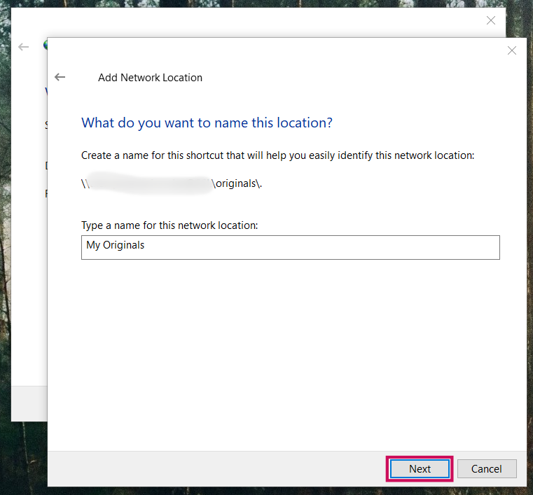
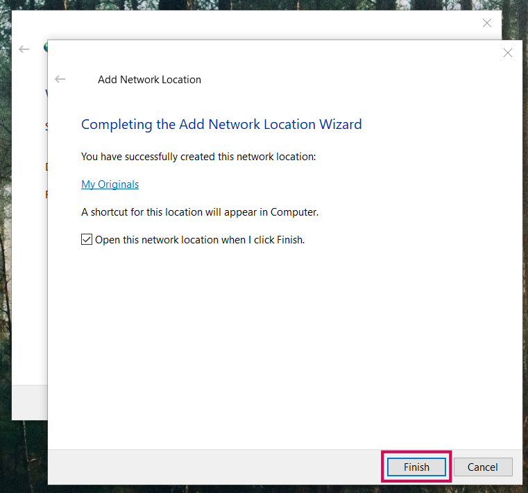
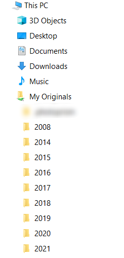

# Connecting via WebDAV #

WebDAV clients, like Microsoft’s Windows Explorer or Apple's Finder,
can connect directly to PhotoPrism.
This mounts the *originals folder* as a network drive and allows you to open, edit, and delete
files from your computer or smartphone as if they were local.

!!! tldr ""
    For security reasons, the built-in WebDAV server is disabled when running in [public mode](../../getting-started/config-options.md) without authentication.

!!! note ""
    It is also possible to [sync files with external WebDAV servers](../settings/sync.md) such as ownCloud or other PhotoPrism instances.

The originals folder URL for public servers is:

```
https://admin@example.com/originals/
```
 or

```
\\example.com@SSL\originals\
```

for Windows 10.

Please replace *example.com* with your actual domain.
The slash at the end is important and cannot be omitted.

When connecting, you'll have to authenticate using your regular password.
It will also change when you update it in *Settings*. The user name is `admin`.

!!! info ""
    You can also connect to the import folder by replacing `originals/` with `import/` in the URL.

For users, who are running PhotoPrism locally on the default port *2342*, the *originals* folder URL is:

```
http://admin@localhost:2342/originals/
```

!!! attention ""
    Never use WebDAV **without HTTPS** outside your local, private network as your
    password would be transmitted, in clear text, over the Internet. Backup tools and file sync apps 
    like [FolderSync](https://www.tacit.dk/foldersync/faq/#i-can-not-connect-to-a-non-https-webdav-server-why)
    may refuse to connect as well.

## Connect to a WebDAV Server##

=== "macOS"

     1. In the **Finder** on your Mac, choose Go > Connect to Server
     2. Enter the URL as shown above in the **Server Address** field
     3. Click **Connect**

=== "Windows 10"

     1. Open Windows **File Explorer**
     2. Right click **This PC**
     3. From the dropdown, select **Map network drive...**

        

     4. Enter the drive letter and folder you want to map your WebDAV connection to
     5. Check the boxes **Reconnect at sign-in** and **Connect using different credentials**
     6. Click the **Connect to a Web site that you can use to store your documents and pictures** link
     
        
     
     7. Click **Next**
     
        
     
     8. Click **Choose a custom network location** and then click **Next**
     
             
     
     9. In the **Internet or network address** field, enter the URL as shown above and click **Next**
        
        
     
     10. Enter your username and password and click **Ok**
     
        
     
     11. Enter a name for the network location and click **Next**
    
        
    
     12. Click **Finish**
    
        
    
     The originals folder appears as a mapped drive in Windows Explorer, and you can immediately add,
     edit, or delete files and directories using the Windows File Explorer.
    
     
    
    If you still have trouble connecting via WebDAV, you may have to
    [update](https://help.dreamhost.com/hc/en-us/articles/216473357-Accessing-WebDAV-with-Windows) the
    Basic Authentication Level in the registry.
