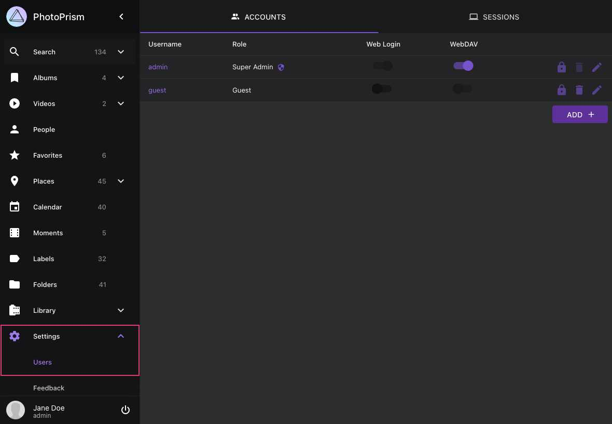
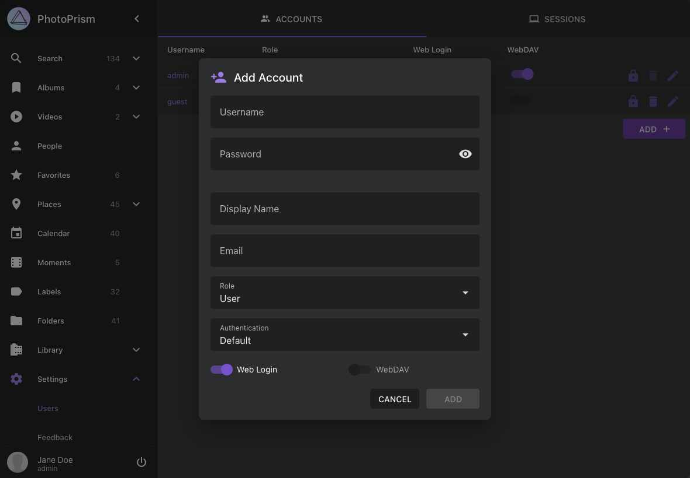
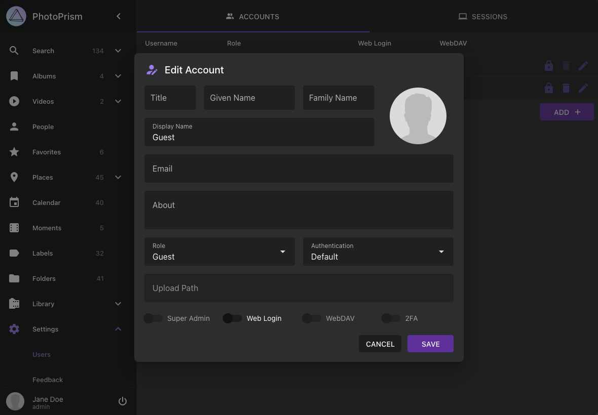
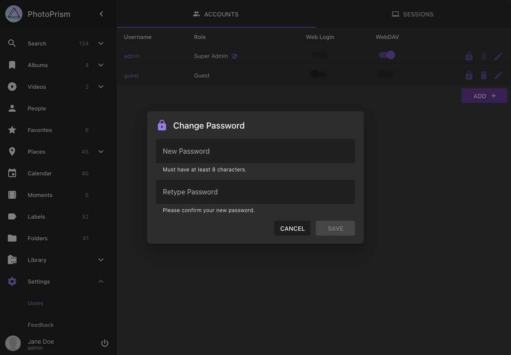
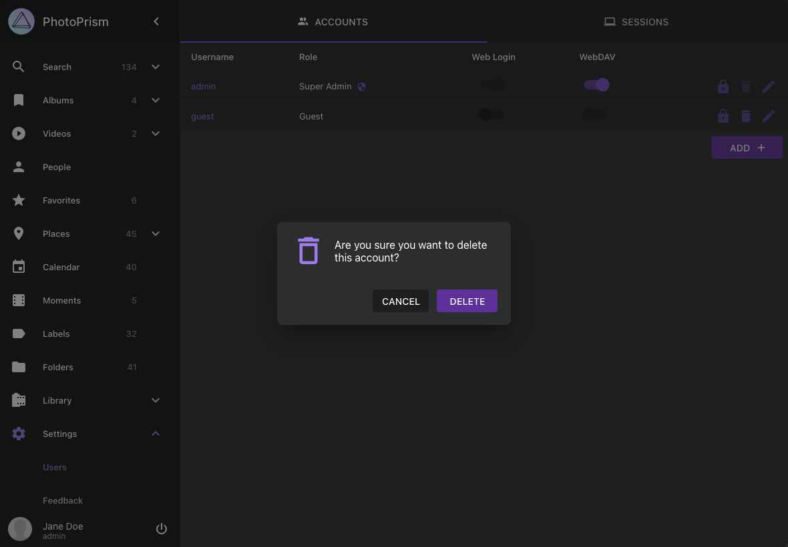
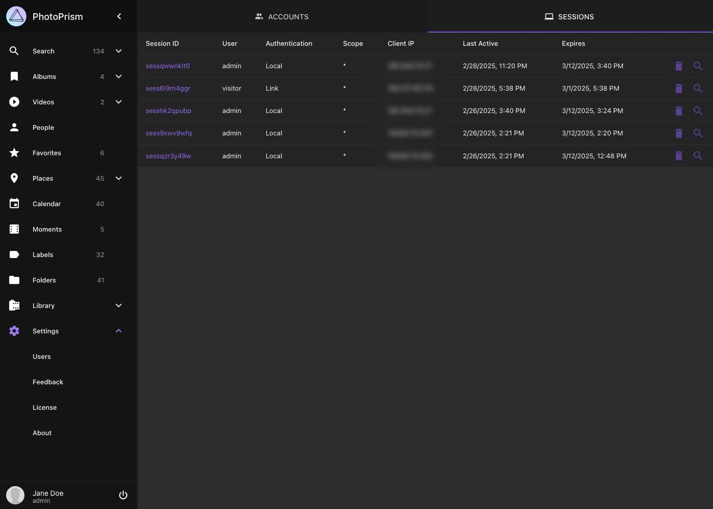

# Managing User Accounts

!!! example ""
    [PhotoPrism® Plus](https://www.photoprism.app/editions#compare) includes a web user interface for account and session management, in addition to the [command-line interface](cli.md) available in all editions.

You can add, edit and delete user accounts by navigating to *Settings > Users* as an [Admin](roles.md#admin):

{ class="shadow" }

## Adding a New User

{ class="shadow" }

## Editing User Details

{ class="shadow" }

Only [super admins](roles.md#admin) can [change the authentication provider](cli.md#command-options) of an account through the web interface, except for their own account, so that they do not accidentally lock themselves out e.g. by setting it to "none".

## Changing Passwords

Super admins can reset a user's password, while regular admins can change passwords only if they know the current password.

{ class="shadow" }

## Deleting a User

{ class="shadow" }

## Managing Sessions

You can view and delete active sessions by navigating to *Settings > Users > Sessions* as an [Admin](roles.md#admin):

{ class="shadow" }

To view session details click :material-magnify:.
To delete a session click :material-delete:.