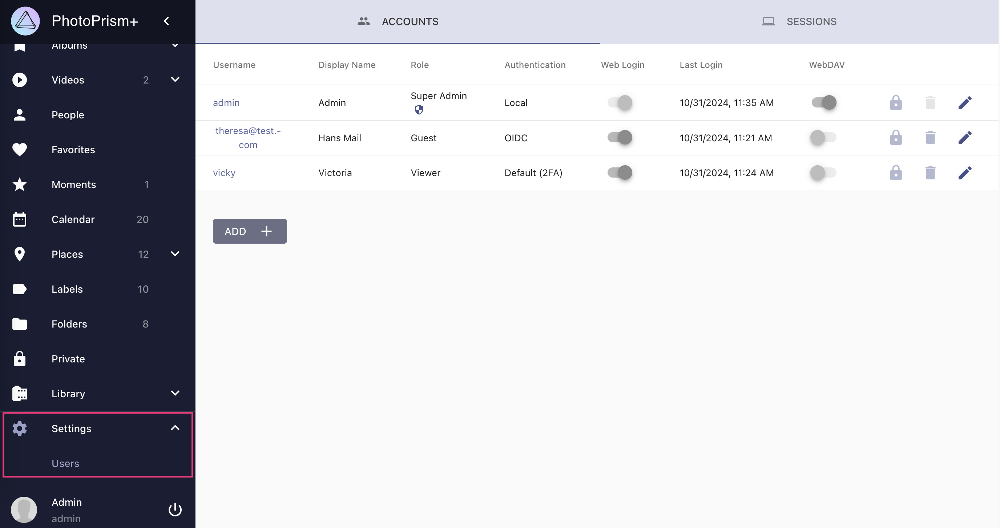
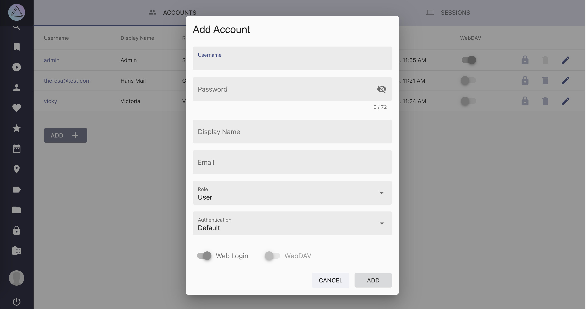
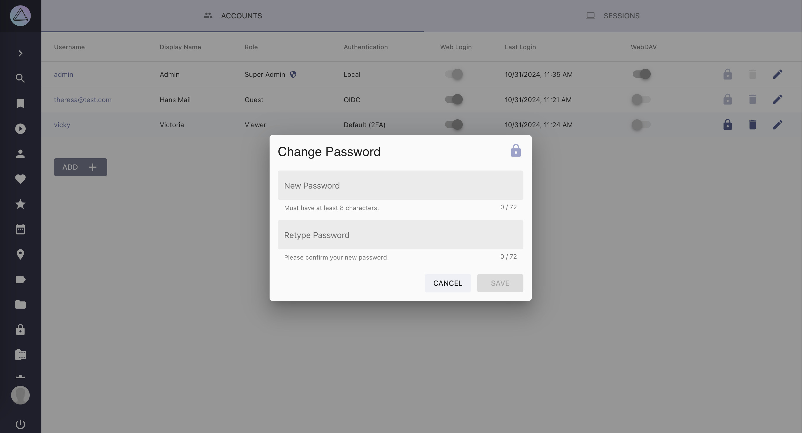

# Managing User Accounts

!!! example ""
    User account roles and the admin web UI are features that are currently only available in [PhotoPrism® Plus](https://www.photoprism.app/editions#compare).

You can add, edit and delete user accounts by navigating to *Settings > Users* as an [Admin](#admin):

{ class="shadow" }

## Adding a New User

{ class="shadow" }

## Editing User Details

{ class="shadow" }

## Changing Passwords

Super admins can reset a user's password, while regular admins can change passwords only if they know the current password.

{ class="shadow" }

## Deleting a User

{ class="shadow" }

## Roles and Permissions

| Role    |   View Library   |     Download     |      Upload      |  WebDAV  |   Full Access    |
|---------|:----------------:|:----------------:|:----------------:|:--------:|:----------------:|
| admin   | :material-check: | :material-check: | :material-check: | optional | :material-check: |
| user    | :material-check: | :material-check: | :material-check: | optional |                  | 
| viewer  |  except private  |  except private  |                  |          |                  |
| guest   |                  |      shared      |                  |          |                  |
| visitor |                  |      shared      |                  |          |                  |

### Admin

*Admins* have unrestricted access to all pictures, albums, and settings.

Regular *Admins* can lose their privileges due to an intentional or accidental role change. However, accounts with the optional "superadmin" status (can be set with the `-s` flag) retain their admin privileges even if they are assigned a non-admin or invalid role. This is to prevent them from locking themselves out.

When *Super Admins* change settings such as the language or theme, these automatically become the default settings for other users, unless they have explicitly made a different choice. In addition, global feature flags can only be changed by *Super Admins*.

### User

*Users* have full access to the library and can view, edit, and delete all pictures and albums. Unlike *Admins*, *Users* cannot view or change the [Library](https://docs.photoprism.app/user-guide/settings/library/) and [Advanced Settings](https://docs.photoprism.app/user-guide/settings/advanced/), only personal  preferences such as theme, language, and password. In addition, their WebDAV access can be disabled. Future releases may include more ways to customize user privileges, e.g. with individual account attributes.

### Viewer

*Viewers* are similar to regular *Users*, except that they do not have write access to the library and cannot see content that has been archived or marked private. They also cannot upload/import files or trigger indexing. Like all registered users, *Viewers* can change and save personal preferences such as theme, language, and password.

### Guest

*Guests* have read-only access to view and download the resources that other users have shared with them. They can also change personal settings such as theme, language, and password.

### Visitor

*Visitors* cannot be added manually. This special role is tied to a system account that represents anonymous users who use links to view albums or other content that has been shared with them. Visitors can only access these resources and cannot log in with a username or password. Other than guests, they also cannot retain their personal settings for longer than their browsing session lasts.

## Sharing Content with Guests
To share resources with Guests who do not have full access, Admins and Users can create [share links](../share/index.md). When a user with limited privileges opens such a link while being logged in, their account will get read-only access to the shared resources. It will later also be possible to share content with other users directly through the web interface without creating links first.
