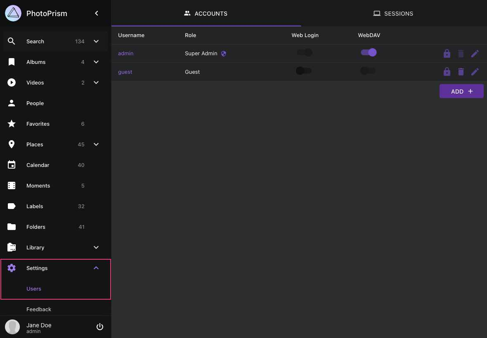
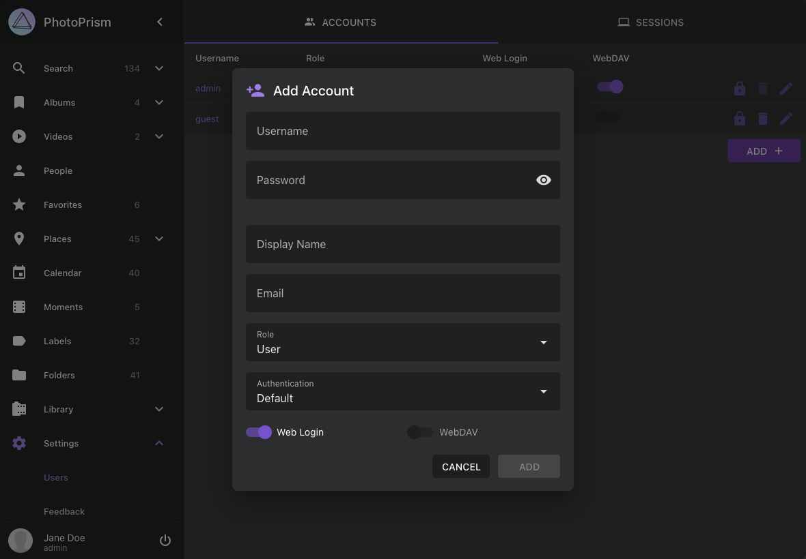
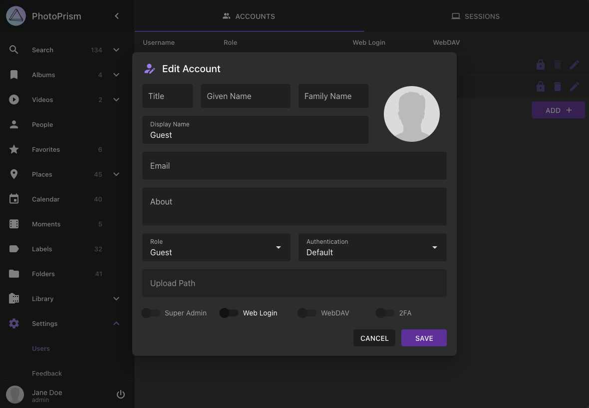
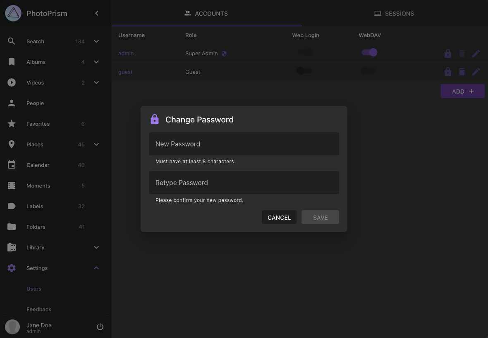
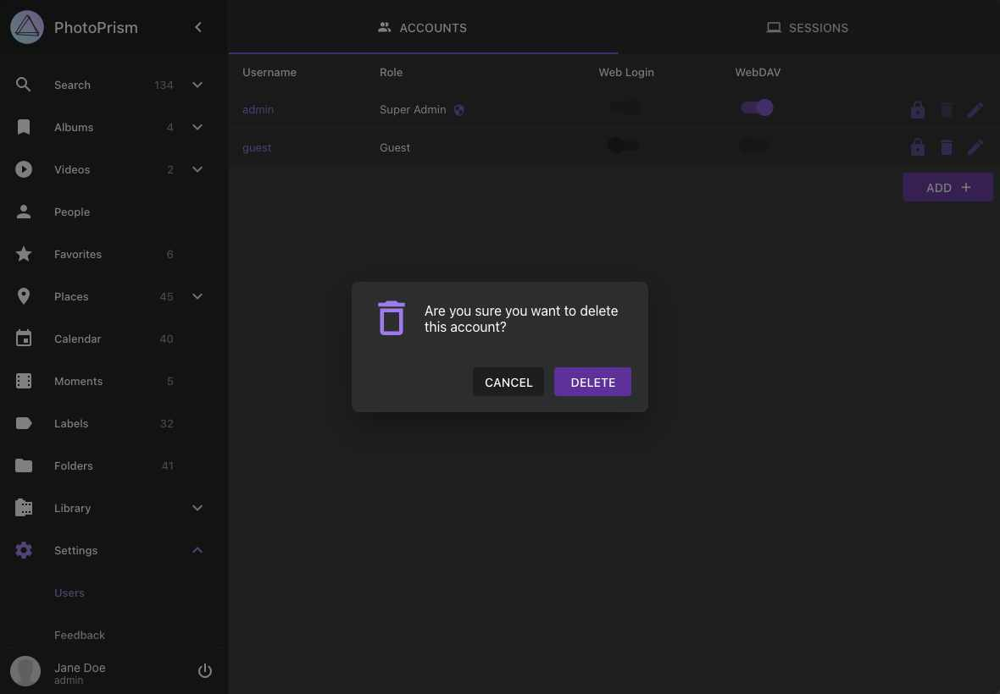
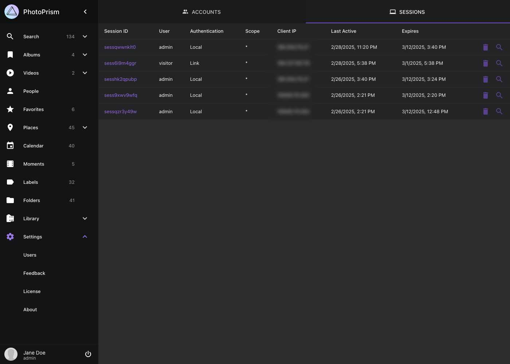

# Managing User Accounts

!!! example ""
    [PhotoPrism® Plus](https://www.photoprism.app/editions/#compare) includes a web user interface for account and session management, in addition to the [command-line interface](cli.md) available in all editions.

You can add, edit, and delete user accounts by navigating to *Settings > Users* as an [Admin](roles.md#admin):

{ class="shadow" }

## Adding a New User

{ class="shadow" }

## Editing User Details

{ class="shadow" }

Only [super admins](roles.md#admin) can change the [authentication provider](cli.md#command-options) of another account through the web interface. Their own account is excluded so that they do not accidentally lock themselves out, for example by setting the provider to `none`.

## Changing Passwords

Super admins can reset another user's password without knowing the current one. Regular admins can change another user's password only if they know the current password.

{ class="shadow" }

## Deleting a User

{ class="shadow" }

## Managing Sessions

You can view and delete active sessions by navigating to *Settings > Users > Sessions* as an [Admin](roles.md#admin):

{ class="shadow" }

To view session details, click :material-magnify:.
To delete a session, click :material-delete:.

!!! info ""
    When a password or privilege level changes, PhotoPrism invalidates that user's other active sessions to protect the account.
