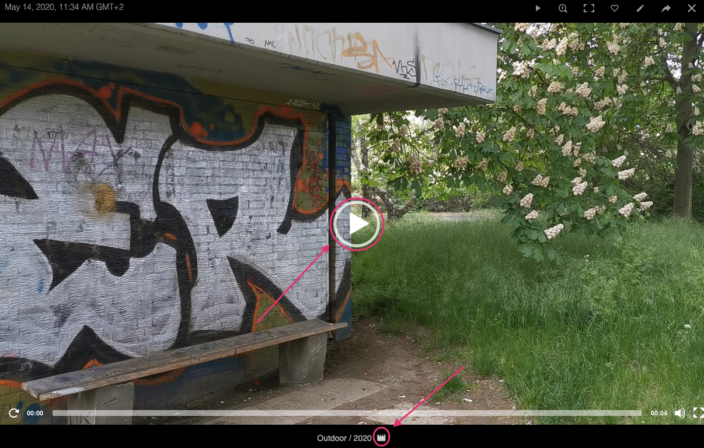
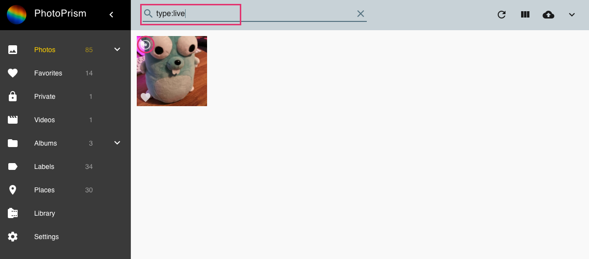

##Videos
PhotoPrism currently supports mp4 videos + @Micha.

Of course there are a lot more formats to come!

In Videos you find all your videos. To play a video click play.

To play videos in fullscreen mode click play on the video or next to the videos title.

## Live photos
Live photos are treated as photos.
They are marked with ICON in the upper left corner.

You can filter for them using `type:live`.

To play a live photo just hover over it.

The following formats are currently supported:
@Micha
