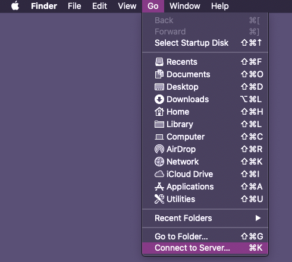
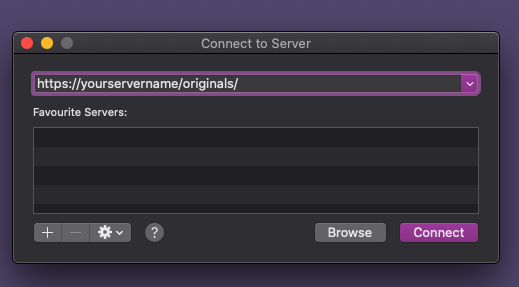

In case you have PhotoPrism running on a server you can use webdav to add files to your import/originals folders.

### Add photos via webdav on MacOS
1. On your computer, open the Finder.
2. On the Finder menu click Go and then Connect to Server. 

      

3. Enter 

    * http://servername/originals/

    or 

    * http://servername/import/

      

4. Click Connect.

5. Enter your username and password. Your username and password can be found in the routes.go file.

6. Now you can move photos to the import/originals folder.

Once all files are added you can start [importing](import.md) or [indexing](index.md) your files.

!!! tip 
    You can also use webdav to download photos from the server. 
    Just connect to http://servername/originals/ and copy the files to your preferred destination.

### Add photos via webdav on Windows
1. Open the windows explorer (e.g. by clicking [Windows] and [E]).
2. Right click on This computer.
3. Select Add network.
4. Click Next.
5. Enter 
   
       * http://servername/originals/
   
       or 
   
       * http://servername/import/
       
6. Enter your username and password. Your username and password can be found in the routes.go file.
7. Now the network appears in your explorer and you can start adding files.

### Add photos via webdav from mobile device
You can use webdav to add photos from your mobile phone or tablet as well.

1. Install an app that supports webdav.
2. Connect to 
      
       * http://servername/originals/
   
       or 
   
       * http://servername/import/
       
3. Move or copy your files.

**WebDav App for iOS:**

* FileExplorer App

**WebDav App for Android:**
